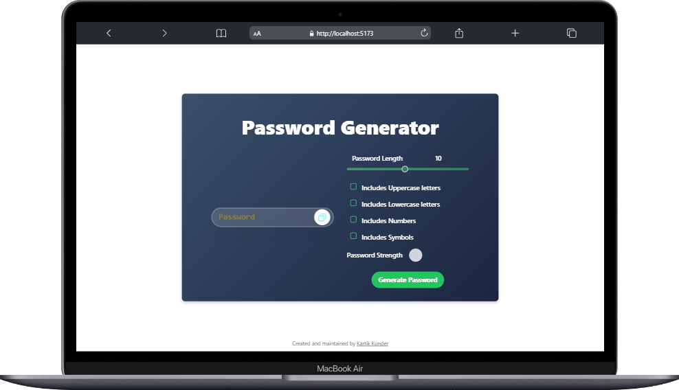
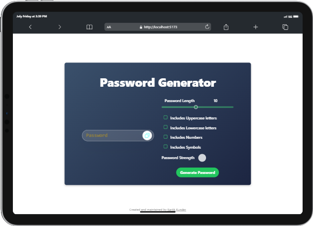
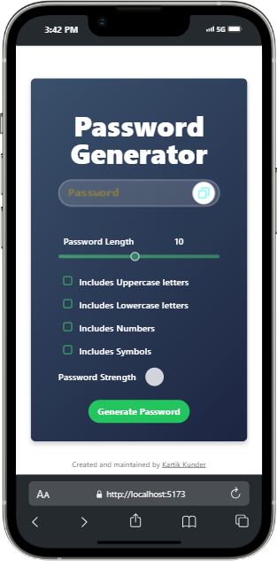

# PassForge Password Generator

A web application for generating secure passwords with customizable options.

## Screenshots

- **Macbook Air**
  

- **iPad Pro 11"**
  

- **iPhone 13 Pro Max**
  

## Description

PassForge is a password generator built using HTML, CSS (with Tailwind CSS), and JavaScript. It allows users to generate passwords of varying lengths and includes options for uppercase letters, lowercase letters, numbers, and symbols.

## Features

- Password length slider
- Checkbox options for character types
- Password strength indicator
- Copy to clipboard functionality

## Installation

1. Clone the repository:
   ```bash
   git clone https://github.com/kartikunder/PassForge.git
   cd PassForge
